# WorkBuddy Skin

在腾讯 WorkBuddy 里一句话安装、换肤，也可以上传明星或二次元参考图，自动提取配色和视觉要素、联网补充公开风格资料，最终生成一套私有 Skin。

> 上游说明：本项目是 [CodeDrobe Core](https://github.com/CodeDrobe/core) 的 WorkBuddy Skin 场景扩展。感谢原作者 [Alone88（@anhao）](https://github.com/anhao) 开源底层运行时与适配器。详细原创边界见文末。

## 在 WorkBuddy 里安装

不需要 Codex。打开 WorkBuddy，把下面这句话直接发给它：

> 请下载 `https://github.com/zhangxiaoqiang1991/workbuddy-skin-skill/releases/latest/download/workbuddy-skin-skill.zip`，完成安全检查后安装为 WorkBuddy 用户 Skill。安装完成后告诉我版本和安装路径。

如果当前 WorkBuddy 版本不允许对话直接安装 GitHub 包：

1. 从 [GitHub Releases](https://github.com/zhangxiaoqiang1991/workbuddy-skin-skill/releases/latest) 下载 `workbuddy-skin-skill.zip`。
2. 打开 WorkBuddy 左侧「专家·技能·连接器」，在技能管理中选择「上传 / 导入技能包」。
3. 选择下载的 ZIP，启用 `WorkBuddy Skin`。

WorkBuddy 官方也支持从左侧 Skill Marketplace 搜索、安装和管理 Skill，参见 [WorkBuddy Skill Marketplace 文档](https://www.workbuddy.ai/docs/workbuddy/From-Beginner-to-Expert-Guide/Function-Description/Skills-Market)。

安装后可以直接说：

> 给我的 WorkBuddy 换成 Sakura Dream Skin，完成后截图验证。

> 用我上传的照片做一套私有 WorkBuddy Skin。明星名是 XX，联网参考公开舞台风格，但不要下载第三方照片。

> 恢复 WorkBuddy 原生界面。

## 10 套内置 Skin 实机截图

以下全部来自 macOS WorkBuddy 5.2.6 实机，截图只保留主工作区，不包含用户姓名和任务列表。
10 套 Skin 均通过自动对比度检查；6 套深色 Skin 另行覆盖了任务正文、表格、产物卡片、输入区和侧栏选中态，避免深色背景出现“黑字看不见”。

<table>
  <tr>
    <td width="50%">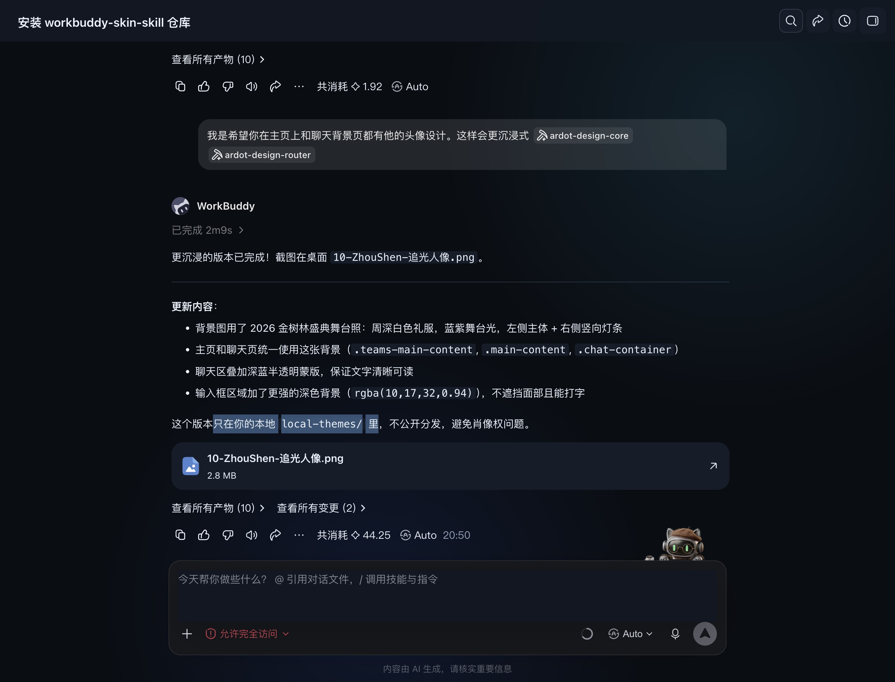<br><code>focus-night</code> · 低干扰深色专注</td>
    <td width="50%">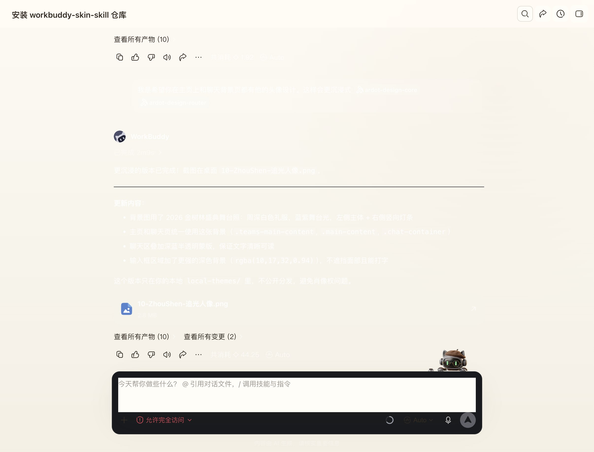<br><code>warm-paper</code> · 暖纸张与墨色</td>
  </tr>
  <tr>
    <td>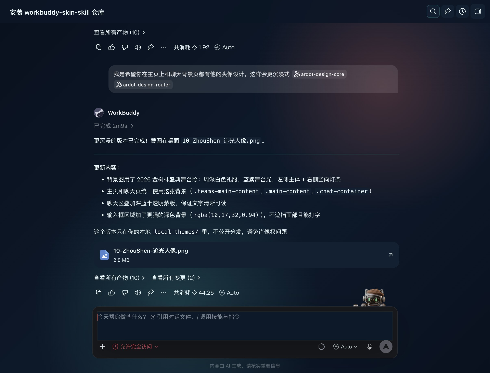<br><code>cyber-lobster</code> · 珊瑚红与赛博青</td>
    <td>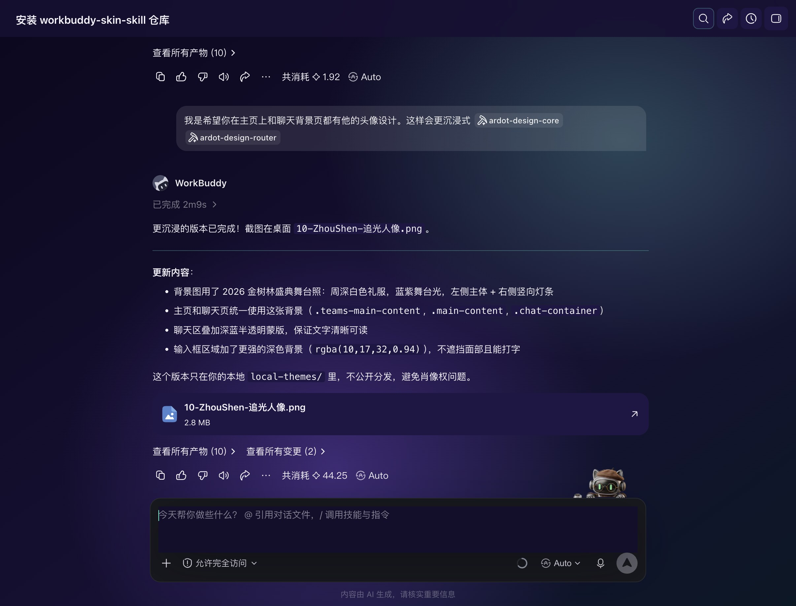<br><code>stage-aurora</code> · 极光舞台感</td>
  </tr>
  <tr>
    <td>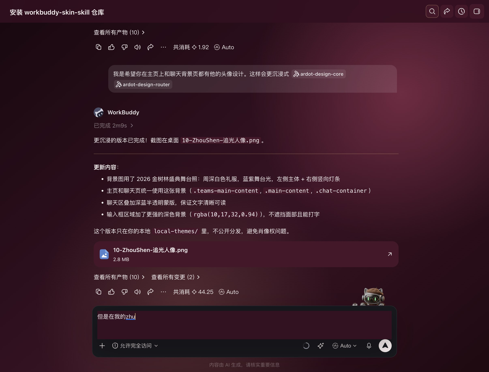<br><code>rose-glam</code> · 玫瑰红毯与香槟金</td>
    <td>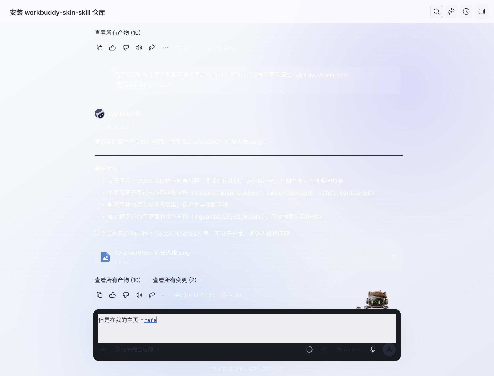<br><code>silver-idol</code> · 银白、淡紫与冰蓝</td>
  </tr>
  <tr>
    <td>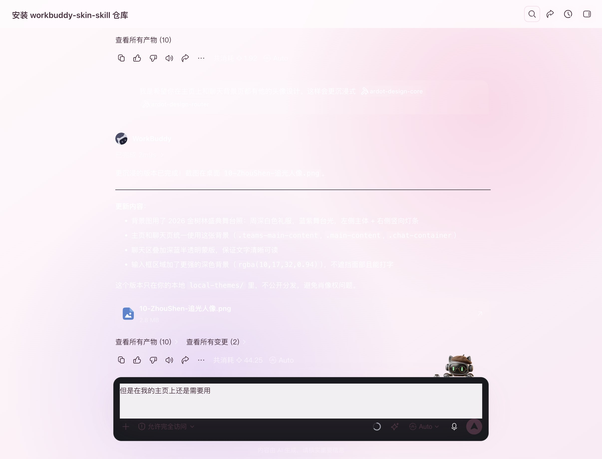<br><code>sakura-dream</code> · 樱粉治愈幻想</td>
    <td>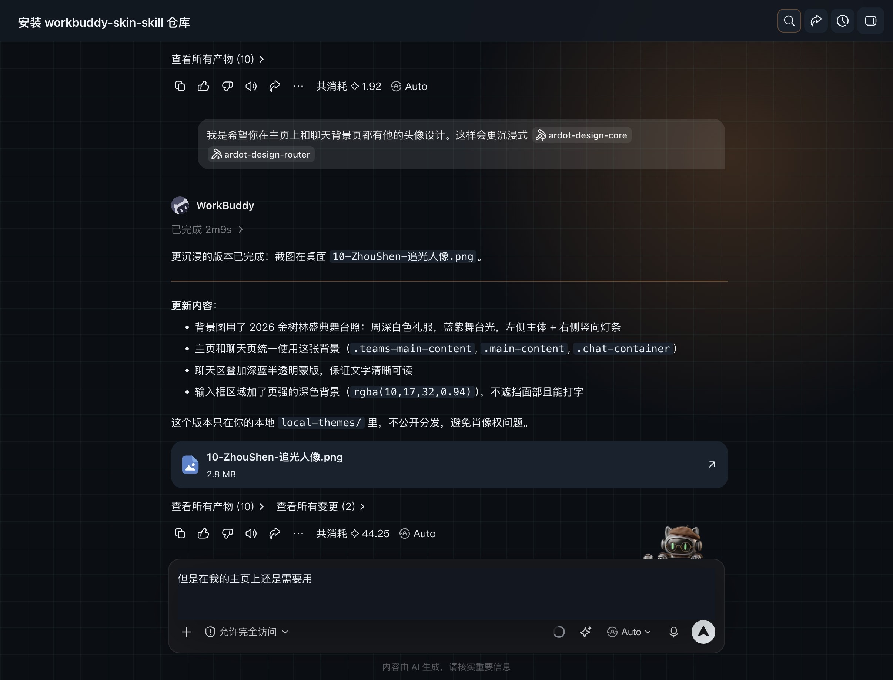<br><code>mecha-core</code> · 机械灰与能量橙</td>
  </tr>
  <tr>
    <td>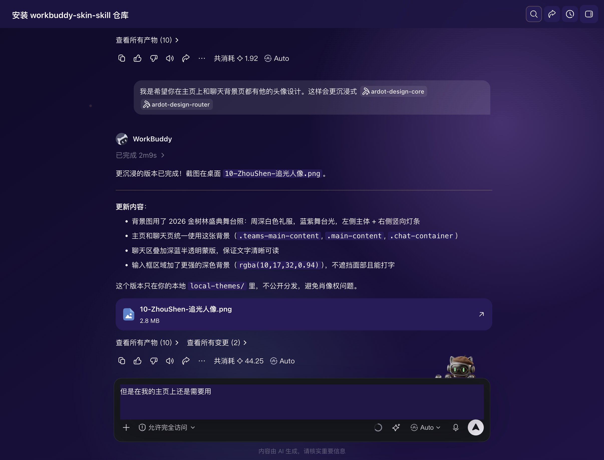<br><code>magical-night</code> · 星空魔法幻想</td>
    <td>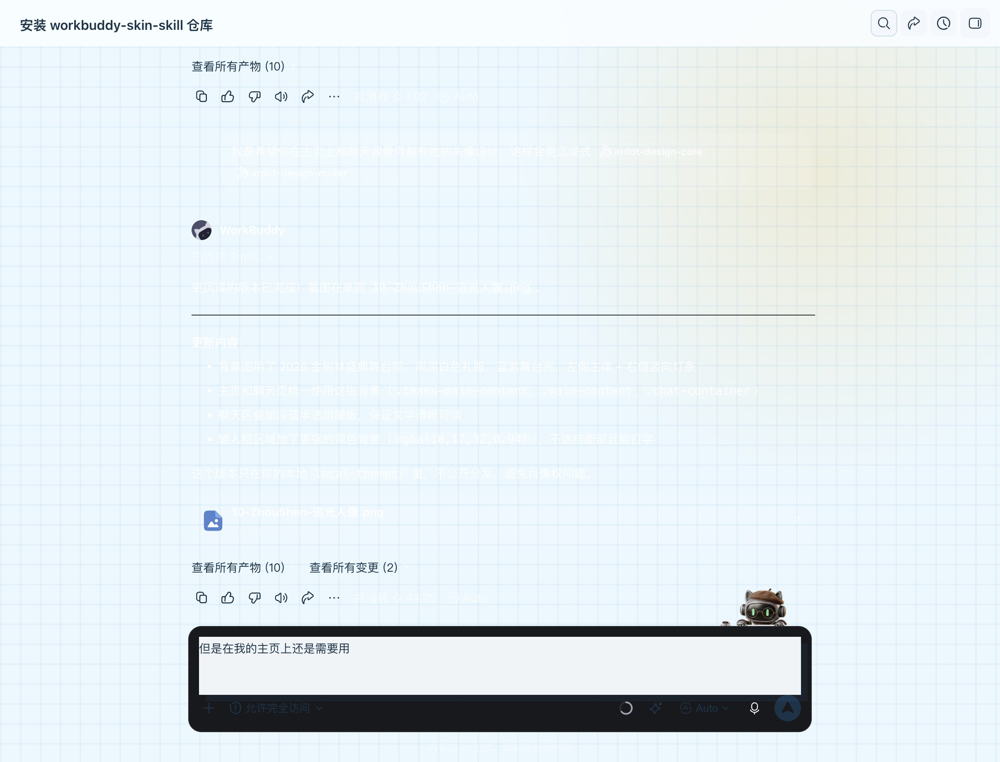<br><code>pixel-campus</code> · 像素校园与天空蓝</td>
  </tr>
</table>

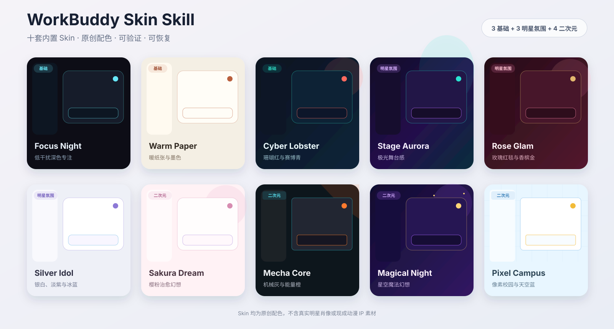

## 上传图片后会做什么

WorkBuddy 会自动完成：

1. 本地读取上传图片，提取主色、辅助色、光线、材质、构图和抽象视觉母题。
2. 如果用户提供明星姓名或作品线索，联网搜索官方工作室、公开活动页和品牌发布页，补充风格参考。
3. 从 10 套内置 Skin 选择最近的骨架，生成新的配色、背景、面板、按钮和输入框样式。
4. 打包、安全检查、应用、截图验证；失败时恢复原生界面。

如果你说“做成某明星风格”并上传有权使用的图片，WorkBuddy 会把大头像同时放进主页与聊天背景，并同步生成对应的灯光、材质和界面氛围；只有你明确说不要照片时才生成纯配色版。

它不会根据人脸反推人物身份，也不会把用户照片上传到搜索引擎做反向搜图。如需搜索某位明星，需要同时提供姓名或文字线索。

## 私有与公开边界

- 上传照片生成的 Skin 默认只保存在本机 `local-themes/` 和 `local-dist/`，这两个目录不进入 Git。
- 公开 Skin 只表达原创审美氛围，不默认包含真实明星肖像、声纹、粉丝标识、官方 Logo，也不包含现成动漫角色、截图和官方素材。
- 用户要求分享或发布带图 Skin 时，需先确认拥有素材权利；否则自动降级为不含照片的原创配色版。

## 底层逻辑

项目固定调用 `@codedrobe/core@0.2.0`，通过只绑定本机的 Chromium DevTools Protocol 注入 CSS。不修改 WorkBuddy 的 `app.asar`、签名、账号、任务和用户文件。

底层包仍使用 CodeDrobe 上游定义的 `.codedrobe-theme` 技术格式；这是兼容性约束，不是对外产品名。对外统一使用 **WorkBuddy Skin**。

第一次换肤时，如果当前 WorkBuddy 没有开放本机 CDP，Skill 会先说明并请求一次重启授权，不会擅自关闭当前 WorkBuddy。

## 开发与验证

```bash
node scripts/workbuddy-skin.mjs list
node scripts/workbuddy-skin.mjs scaffold my-private-skin --from stage-aurora --art /absolute/image.jpg
npm test
npm run pack
npm run inspect
```

## 开源协议

本项目使用 [MIT License](LICENSE)。底层依赖 CodeDrobe Core，遵循其 Apache-2.0 许可，详见 [NOTICE](NOTICE)。

## 致谢与原创说明

这个项目不是从零发明 WorkBuddy 换肤底层，也不把上游能力改名后当成自己的原创。

特别感谢 [CodeDrobe](https://github.com/CodeDrobe) 项目及原作者 [Alone88（@anhao）](https://github.com/anhao)。本项目使用的 CDP 注入机制、跨应用运行时、WorkBuddy 适配器和 `.codedrobe-theme` 包规范，来自其开源项目 [CodeDrobe Core](https://github.com/CodeDrobe/core)，上游采用 Apache-2.0 协议。

本仓库在上游能力之上新增了：

- WorkBuddy 内直接安装与运行的 Skin Skill 工作流。
- 10 套原创 Skin 设计与 CSS。
- 上传图片的视觉提取、联网研究、私有打包和权利分级流程。
- Skin 打包、应用、验证、脱敏截图和恢复的统一入口。
- WorkBuddy 5.2.6 macOS 实机适配、视觉迭代和中文文档。

本项目与 CodeDrobe 是“上游运行时 + WorkBuddy Skin 场景扩展”的关系。二次发布或改造时，请继续保留 CodeDrobe、Alone88、上游仓库和 Apache-2.0 协议信息。

## 反馈 & 帮助迭代

欢迎在 [Issues](https://github.com/zhangxiaoqiang1991/workbuddy-skin-skill/issues) 页面提交反馈，或直接联系作者。

## 关于我

**大厂转型人强哥**（全网同名）

河北邯郸人，曾武汉求学，现居北京。曾就职腾讯、字节跳动。目前负责 AI + 内容增长、产品运营。关注以下三方面的机会，欢迎交流 / 围观朋友圈：

- **AI 内容运营**：从战略、策略到执行的内容增长
- **AI 培训 / 布道**：帮团队真正用好 AI，不只是上个课
- **AI 内部提效**：搭建工具流，把 AI 落地到业务流程里

**联系方式与链接：**

- 微信：`qianggegood123`（有对应付费社群和咨询服务，若感兴趣私聊即可）
- 小红书：[强哥 @andyxqzhang](https://www.xiaohongshu.com/user/profile/617395d8000000001f0362a3)
- Twitter：[@andyxqzhang001](https://x.com/andyxqzhang001)
