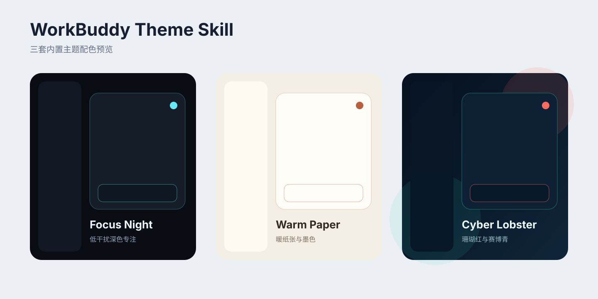

# WorkBuddy Theme Skill

用 Codex 一句话，为腾讯 WorkBuddy 生成、应用和恢复定制皮肤。

> 上游说明：本项目是 [CodeDrobe Core](https://github.com/CodeDrobe/core) 的 WorkBuddy 场景扩展。感谢原作者 [Alone88（@anhao）](https://github.com/anhao) 开源底层运行时与适配器。详细原创边界与新增内容见文末“致谢与原创说明”。



## ① 安装方式

```bash
npx skills add zhangxiaoqiang1991/workbuddy-theme-skill --global
```

安装后可以直接对 Codex 说：

> 给 WorkBuddy 换成深色专注主题，完成后截图验证。

要求：

- Node.js 22.4 或更高版本。
- macOS 12 或更高版本。
- 腾讯 WorkBuddy 桌面版。

本 Skill 推荐由 Codex 调用。兼容 Agent Skills 目录规范的其他工具也可以读取它，但皮肤目标仅为 WorkBuddy，不会修改 CodeBuddy、Trae 或其他应用。

## ② 底层逻辑

> 皮肤应该是可验证、可恢复的数据包，不应该修改官方客户端。

项目固定调用 `@codedrobe/core@0.2.0`，通过仅绑定本机的 Chromium DevTools Protocol 注入 CSS。它不会修改 WorkBuddy 的 `app.asar`、签名、账号、任务和用户文件。

主题包只允许声明式配置、CSS 和可选本地图片。外部 CSS 资源、主题 JavaScript 和追踪像素会被拒绝。

## ③ 具体怎么做

### 直接使用内置主题

```bash
node scripts/workbuddy-theme.mjs list
node scripts/workbuddy-theme.mjs apply focus-night
```

三套内置主题：

| 主题 | 风格 | 适合场景 |
|---|---|---|
| `focus-night` | 深色、青蓝、低干扰 | 长时间专注工作 |
| `warm-paper` | 暖白、墨色、纸张感 | 写作、阅读、内容创作 |
| `cyber-lobster` | 深海蓝、珊瑚红、青色 | 展示、录屏、个性化桌面 |

### 检查环境

```bash
node scripts/workbuddy-theme.mjs doctor
```

### 验证并截图

```bash
node scripts/workbuddy-theme.mjs verify focus-night \
  --screenshot /absolute/workbuddy-theme.png
```

### 恢复原生界面

```bash
node scripts/workbuddy-theme.mjs restore
```

### 用 AI 定制新主题

对 Codex 说：

> 参考这张图片，为 WorkBuddy 做一套奶油橙主题。保留全部功能，完成后截图验证。

Codex 会复制现有主题、调整 CSS、增加版本号、打包主题并执行验证。主题源码在 `themes/`，可分享文件生成在 `dist/`。

## ④ 注意事项

- 不要修改 WorkBuddy 安装包或 `app.asar`。
- WorkBuddy 已经运行但未开放 CDP 时，工具不会擅自重启。只有明确传入 `--restart-existing` 才会重启。
- 页面升级可能改变 DOM。每次 WorkBuddy 大版本更新后都要重新跑 `probe`、`apply`、`verify`、`restore`。
- 当前正式验证环境为 macOS WorkBuddy 5.2.6。
- Windows 启动入口已经存在，但还没有完成本项目的 Windows 实机验证，因此只标记为实验性支持。
- 不要把明星图片、品牌素材或私人参考图直接打进公开主题包，除非已确认授权。

## ⑤ 案例展示

### 深色专注主题

```text
用户：把 WorkBuddy 改成深色专注风格，保留所有按钮。
Codex：检查安装和 DOM，应用 focus-night，验证侧边栏、工作区和输入框，输出截图。
```

### 品牌配色主题

```text
用户：主色用 #FF6B35，背景偏暖，卡片更轻，其他功能不要动。
Codex：复制 warm-paper，生成新 ID，调整变量，打包、检查、应用、截图验证。
```

配色预览只是主题方向示意，最终效果以 WorkBuddy 实机截图验证为准。

## 开发与验证

```bash
npm test
npm run pack
npm run inspect
```

## 开源协议

本项目使用 [MIT License](LICENSE)。底层依赖 CodeDrobe Core，遵循其 Apache-2.0 许可，详见 [NOTICE](NOTICE)。

## 致谢与原创说明

这个项目不是从零发明 WorkBuddy 换肤底层，也不把上游能力改名后当成自己的原创。

特别感谢 [CodeDrobe](https://github.com/CodeDrobe) 项目及原作者 [Alone88（@anhao）](https://github.com/anhao)。本项目使用的 CDP 注入机制、跨应用运行时、WorkBuddy 适配器和 `.codedrobe-theme` 主题包规范，来自其开源项目 [CodeDrobe Core](https://github.com/CodeDrobe/core)，上游采用 Apache-2.0 协议。

本仓库在上游能力之上新增了：

- 面向 Codex 等 Agent 的 WorkBuddy 专用 Skill 工作流。
- `focus-night`、`warm-paper`、`cyber-lobster` 三套主题设计与 CSS。
- 主题打包、应用、验证、截图和恢复的统一入口脚本。
- WorkBuddy 5.2.6 macOS 实机适配、视觉迭代和中文使用文档。

本项目与 CodeDrobe 是“上游运行时 + WorkBuddy 场景扩展”的关系。二次发布或改造时，请继续保留 CodeDrobe、Alone88、上游仓库和 Apache-2.0 协议信息。

## 反馈 & 帮助迭代

欢迎在 [Issues](https://github.com/zhangxiaoqiang1991/workbuddy-theme-skill/issues) 页面提交反馈，或直接联系作者。

## 关于我

**大厂转型人强哥**（全网同名）

河北邯郸人，曾武汉求学，现居北京。曾就职腾讯、字节跳动。目前负责 AI + 内容增长、产品运营。关注以下三方面的机会，欢迎交流 / 围观朋友圈：

- **AI 内容运营**：从战略、策略到执行的内容增长
- **AI 培训 / 布道**：帮团队真正用好 AI，不只是上个课
- **AI 内部提效**：搭建工具流，把 AI 落地到业务流程里

**联系方式与链接：**

- 微信：`qianggegood123`（有对应付费社群和咨询服务，若感兴趣私聊即可）
- 小红书：[强哥 @andyxqzhang](https://www.xiaohongshu.com/user/profile/617395d8000000001f0362a3)
- Twitter：[@andyxqzhang001](https://x.com/andyxqzhang001)
